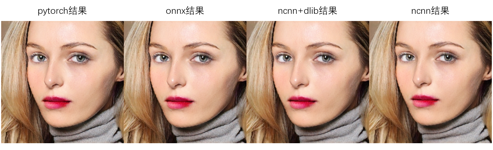

# PSGAN-NCNN
### What
1. PSGAN是CVPR2020上的一个妆容迁移的工作，该工程的目的是将PSGAN移植至c++，并将所有模型使用ncnn进行推理
2. 妆容迁移：有一张上了妆的人脸图像A，有一张没上妆的素颜人脸图像B，妆容迁移就是给B上A的妆容

### Introduce

1. PSGAN提出的模型是2stage的，第一个stage计算两个特征值gamma和beta，第二个stage才计算迁移后的妆容，所以有两个模型
2. 人脸的预处理，PSGAN的实现用了dlib的人脸检测和人脸68点关键点，还有一个pytorch的人脸属性分割模型
3. 如代码所示，我除了dlib的方法外，我还收集了可以在ncnn上运行人脸检测和人脸关键点的模型对dlib进行了替换

### Source Code
1. opencv_dlib_ncnn_vs2019：opencv + dlib + ncnn的VS2019工程(最直接实现)
2. opencv-mobile_ncnn_vs2019：opencv-mobile + ncnn的VS2019工程(最小依赖实现)
3. opencv-mobile_ncnn_qt_vs2019：opencv-mobile + ncnn + qt界面的VS2019工程

### Resource
1. 带有qt gui的exe程序: [百度网盘](https://pan.baidu.com/s/1PzlkoM3pC9Zxo9KDuNsdNw)(提取码:6666)

2. 知乎分析文章：https://zhuanlan.zhihu.com/p/426474467

### Reference
1. PSGAN: https://github.com/wtjiang98/PSGAN
2. ncnn: https://github.com/Tencent/ncnn
3. dlib: https://github.com/davisking/dlib
4. opencv: https://github.com/opencv/opencv
5. opencv-mobile: https://github.com/nihui/opencv-mobile
6. LFFD-with-ncnn: https://github.com/SyGoing/LFFD-with-ncnn
7. Peppa-Facial-Landmark-PyTorch: https://github.com/ainrichman/Peppa-Facial-Landmark-PyTorch
